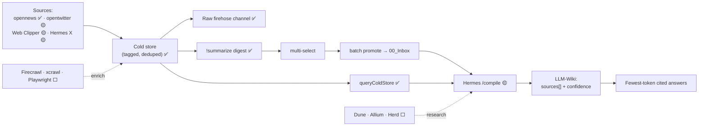

# Crypto Engram LLM-Wiki

**A personalized crypto/AI knowledge brain — an LLM-maintained wiki fed by an always-on, pre-scored news firehose.**

*An **engram** is a memory trace the brain physically encodes. This system is the same idea for crypto/AI research: a noisy firehose is scored at ingest and consolidated into cited, confidence-scored knowledge — it selectively encodes what matters instead of storing everything (the anti-RAG).*

> Inspired **solely** by Andrej Karpathy's idea of an **LLM-maintained wiki**: a knowledge base an LLM continuously compiles, cross-links, and cites — not a pile of documents you re-embed on every query. This repo is one person's crypto/AI-focused take on that idea.

> ⚠️ **This is an MVP design, not a committed roadmap.** Parts of the system are built and running; parts are designed but not yet wired; parts are still aspirational. Every component is labeled with an honest status so nothing reads as more finished than it is. The design is still being decided and amended.
>
> **Status legend:** ✅ Built · 🟡 Designed (spec locked, not wired) · ⬜ Planned (aspirational)

Full design: **[`docs/ARCHITECTURE.md`](docs/ARCHITECTURE.md)** · Decisions: [`docs/DECISIONS.md`](docs/DECISIONS.md)

---

## Why not just RAG?

The goal is to **retrieve the most accurate answer for the fewest tokens** — accuracy · relevancy · cost-efficiency.

Standard RAG decides relevance *at query time* by embedding everything and ranking by vector similarity. A junk tweet where someone is just yapping and happens to type `$HYPE` ranks **high** for "HYPE news" — because it *is* topically similar, and similarity is all RAG sees.

This system decides relevance **at ingest**, stores it as **structured tags + scores**, and retrieves with a **deterministic filter** — no embeddings, no vector DB, no per-query model call.

| | Standard RAG | This system |
|---|---|---|
| Relevance decided | Query time (cosine similarity) | **Ingest time (structured tags + scores)** |
| Retrieval | Vector top-k over raw text | **Filter: `coins ∪ themes` AND `score/since/signal`** |
| Junk `$HYPE` tweet | Retrieved | **Filtered out** |
| Cost per query | Embed + ANN search | **JSON filter (≈ free)** |
| Into the model | Top-k raw chunks | **Pre-filtered, capped, lean cards** |

The result is a **personalized knowledge brain**: it only reasons over material *you* chose to watch, pre-scored for quality, with junk gated before it can dilute an answer. See [`docs/ARCHITECTURE.md`](docs/ARCHITECTURE.md) for how a junk `$HYPE` tweet is told apart from real signal.

---

## How it works

Two clocks, two tiers:

```text
Tier 1 — Firehose (node, free, continuous)
  sources → tag (coins · themes · aiRating) → cold store (deduped) → raw firehose channel (archive)
  !summarize → grouped Coins/Themes digest → multi-select → batch promote → 00_Inbox

Tier 2 — LLM-Wiki (agent / Hermes, scheduled, costs tokens)
  raw + digest → analyze → compile Topics / Entities / Sources / Synthesis
  every page cites sources[] + confidence → lint must pass
```

**Ongoing delivery** comes from multiple surfaces feeding one cold store:

- **opennews (6551 REST)** — curated crypto/AI news, AI-rated · ✅ Built
- **opentwitter (MCP)** — watched-account posts · 🟡 Designed
- **Web Clipper** — human-clipped articles · 🟡 Designed
- **Hermes X agent** — X bookmarks 💾-saved into the vault · 🟡 Designed

**Deep-fetch (full content)** ⬜ Planned — Firecrawl (articles → clean markdown), xcrawl (X threads), Playwright (auth/JS/local-first fallback).

**Onchain research MCPs** ⬜ Planned — Dune, Allium, Herd, so the agent can check claims against chain data during compile.



---

## What's actually built ✅

- opennews firehose: curated union feed (coins pull + N theme pulls), dedup, pagination-for-recall, 4×/day cadence, cold store as seen-set.
- Facet tagging (`watchlist_coins`, `matched_themes`, `aiRating`) on every item.
- Discord raw firehose channel with facet tag lines, plus a `!summarize [since]` command that posts a grouped Coins/Themes digest with a multi-select **batch promote** to the LLM-wiki (replaces per-message 💾).
- Deterministic retrieval: `queryColdStore` + `formatDigest` + `npm run digest`.
- Vault scaffold, `/compile` frontmatter contract, `lint:wiki`, 76 passing tests.

See the full [status matrix](docs/ARCHITECTURE.md#status-matrix) for what's designed vs planned.

---

## Setup

```sh
cd /Users/angjingkang/content-intelligence-system
npm run setup-vault
```

Open the vault in Obsidian:

```sh
open -a Obsidian "/Users/angjingkang/content-intelligence-system/vault/Content_Intelligence_Vault"
```

## Commands

```sh
npm run setup-vault
npm run ingest:mock
npm run ingest:manual
npm run ingest:web-clipper
npm run ingest:opennews
npm run bot:start        # firehose → Discord; !summarize → digest + batch promote
npm run digest -- --coin HYPE --since 24h   # deterministic retrieval
npm run lint:wiki
npm run test
```

`ingest:opennews` and `bot:start` read `OPENNEWS_TOKEN` (and the bot also `DISCORD_BOT_TOKEN` + `DISCORD_CHANNEL_ID`) from `.env` — copy `.env.example` and fill in real values; `.env` is gitignored and never committed. Firehose filters are documented in [`docs/FIREHOSE_FILTERS.md`](docs/FIREHOSE_FILTERS.md).

## Design rule

```text
00_Inbox/    raw evidence only, source of truth, never edited or deleted
05_Sources/  agent: one source-summary per raw doc
10_Topics/   agent: evolving understanding
20_Entities/ agent: people, protocols, companies, chains, tokens
30_Timelines/ node: chronological memory
60_Discord_Queues/ node: notification drafts for Hermes
.system/     node: dedupe, source, routing, ingest scores (never on a page)
firehose/    node: cold store, OUTSIDE the vault, gitignored — stored, never indexed
```

Node and agent own **different files** (no skeleton-then-enrich). Retrieval reads the compiled + indexed layer only; uncompiled raw is stored but not indexed, reached only by escalation through `sources[]`.

## Safety / scope

Not an autoposter, trading bot, wallet signer, or full RAG/embeddings system. No browser automation in the node runtime. The writer resolves all paths against the vault root, blocks path traversal, and never deletes raw source files. `discord.js` is the sole external dependency; the 6551 pull is zero-dep native `fetch`. The deep-fetch and onchain-MCP layers are **designed, not deployed**.
