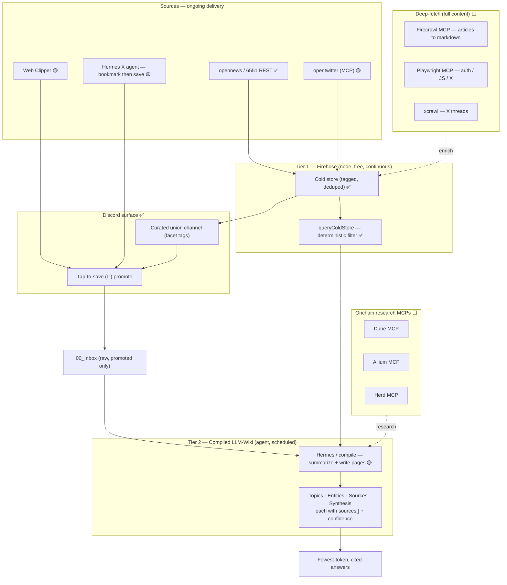
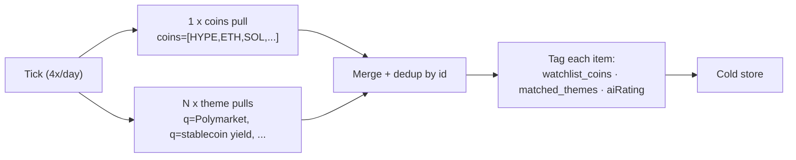
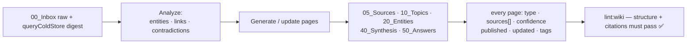

# Crypto Engram LLM-Wiki — Architecture

*A personalized crypto/AI knowledge brain.*

> **Status legend:** ✅ Built · 🟡 Designed (spec locked, not wired) · ⬜ Planned (aspirational)
>
> **This is an MVP design document, not a committed roadmap.** Much of the target
> system below is still being decided and amended. Components are labeled with
> their real status so nothing reads as more finished than it is.

---

## Inspiration

This project is inspired **solely** by Andrej Karpathy's note on the idea of an
**LLM-maintained wiki** — a knowledge base an LLM continuously compiles, cross-links,
and cites, rather than a pile of documents you re-embed on every query. Everything
here is one person's attempt to build a *personal, crypto/AI-focused* version of that
idea. No other framework, product, or methodology is a source.

The one adaptation: Karpathy's wiki is the **compiled brain** (Tier 2 below). On top
of it this project adds an **always-on ingestion firehose** (Tier 1) so the wiki is
fed a curated, pre-scored stream instead of ad-hoc pastes.

---

## The thesis: this is *not* RAG

The overriding goal is: **retrieve the most accurate answer for the fewest tokens** —
accuracy · relevancy · cost-efficiency.

Standard RAG decides relevance *at query time* by embedding everything and ranking by
vector similarity over raw text. That is exactly why a junk tweet where someone is just
yapping and happens to type `$HYPE` ranks **high** for a "HYPE news" query — it is
topically similar, and similarity is all RAG can see. You also pay embedding + vector
search on every item and every query, and you stuff noisy near-matches into context.

This system decides relevance **at ingest**, stores it as **structured tags + scores**,
and retrieves with a **deterministic filter** — no embeddings, no vector DB, no
per-query model call for retrieval. Then an agent summarizes only the filtered items.

### RAG vs this system

| | Standard RAG | This system |
|---|---|---|
| When relevance is decided | Query time | **Ingest time** |
| How relevance is represented | Cosine distance over raw text | **Structured tags + explicit scores** (AI rating, per-coin grade/signal, theme provenance) |
| Retrieval mechanism | Vector similarity top-k | **Deterministic filter**: `coins ∪ themes` AND `score/since/signal` |
| Junk `$HYPE` tweet | Retrieved (topically similar) | **Filtered out** (fails score floor / no structured coin tag) |
| Cost per item | Embed on ingest | Tag on ingest (≈ free) |
| Cost per query | Embed query + ANN search | **Filter over JSON (≈ free)** |
| Tokens into the model | Top-k raw chunks | **Pre-filtered, capped, lean cards only** |
| Trust / signal awareness | None | **Grade + signal + source-trust gates** |

The result is a **personalized, customized knowledge brain**: it only ever reasons over
material *you* chose to watch, pre-scored for quality, with junk gated before it can
dilute an answer.

---

## System overview



### Two clocks

- **Node clock — free, continuous.** Pulls sources, tags and dedupes into the cold
  store, posts to Discord, runs deterministic retrieval. No model tokens.
- **Agent clock — scheduled, costs tokens.** Hermes summarizes / compiles the wiki.

Retrieval reads the **compiled + indexed layer only**. Uncompiled raw is *stored but
not indexed*, so it can never dilute an answer — it is reached only by escalation
through `sources[]`.

---

## Tier 1 — the firehose (ongoing delivery)

The firehose is what keeps the brain fed without you lifting a finger. Every source
lands in one **cold store** (JSON per item, outside the vault, gitignored) that doubles
as a permanent **seen-set** for dedup.

### Sources

| Source | What it delivers | Status |
|---|---|---|
| **opennews (6551 REST)** | Curated crypto/AI news, AI-rated | ✅ Built |
| **opentwitter (MCP)** | Watched-account posts | 🟡 Designed |
| **Web Clipper** | Human-clipped articles → raw drops | 🟡 Designed |
| **Hermes X agent** | X bookmarks 💾-saved into the vault | 🟡 Designed |

### The curated union feed ✅

A broad "give me crypto news" pull returns mostly noise. Instead, each tick **fans out**
into a *union* of narrow queries and merges the results:



- A single API request can only **narrow** (`coins` AND `q` = fewer results), so a
  *union* ("HYPE **or** Polymarket") is assembled client-side across `1 + N` pulls.
- Themes like *Polymarket* or *prediction markets* carry **no coin tag**, so they can
  only be reached by full-text `q` — that is why theme pulls exist alongside coin pulls.
- **Pagination for recall:** each query pages newest→older until a fully-seen page
  (the cold-store seen-set proves the gap is covered), a short page, or a page cap.
  This is what makes a 4×/day cadence safe — nothing in the gap is dropped.

### The tags that replace embeddings ✅

Every stored item carries, alongside its raw payload:

- **`watchlist_coins`** — the source's *structured* coin tags (`raw.coins[].symbol`)
  intersected with your watchlist, **after dropping noisy equity tickers**. This keys
  off entity tagging, **not** the text containing a ticker string.
- **`matched_themes`** — *which* curated theme query surfaced the item (provenance).
- **`aiRating` = `{score 0–100, grade A/B/C, signal long/short/neutral}`** — the source
  engine's own quality/conviction rating.

In Discord these render as facet tags (`· HYPE · #Polymarket · AI 88 A long`) so the
mixed feed stays sliceable by coin and theme.

---

## Fetch & retrieval design (the core)

Retrieval is `queryColdStore` — a **pure, repeatable filter**, no AI and no network:

```
topic filter (UNION):   item matches if it touches ANY requested coin OR ANY requested theme
narrowing (AND):        aiRating.score >= minScore
                        aiRating.signal == signal   (optional)
                        published >= since
sort:                   newest first
shape:                  lean cards (title, url, coins, themes, score/grade/signal, text)
```

### How it tells signal from a junk `$HYPE` tweet

This is the question RAG can't answer. Here it's answered by **gates a vector store
doesn't have**:

1. **Score floor.** The AI rating gates low-quality items; a "just yapping" post fails
   `minScore`.
2. **Structured coin tag, not text match.** Junk often carries no strong structured coin
   tag (or a low per-coin grade), so it never enters `watchlist_coins` — even though the
   text says `$HYPE`.
3. **Theme provenance + grade.** A kept item came from a theme you chose and can be
   preferred by grade.

For **human-bookmarked** items (Web Clipper, Hermes X 💾) there is *no* source AI rating.
There the differentiator moves to the **compile step**:

```
compile priority = content_potential × source_trust × recency
```

A yapping bookmark has near-zero content-potential (no claims, no entities) → it never
gets elevated into a compiled topic page; it stays a thin, low-`confidence` source note.
**Relevance is never a page field — only a `.system` sort hint.** That is the guarantee
that accidental junk can't pollute the brain.

---

## Deep-fetch layer ⬜

Headlines and snippets aren't enough for real research, so full content is fetched on
demand and used to enrich the cold-store item / source note.

| Tool | Role | Why |
|---|---|---|
| **Firecrawl MCP** | Primary: article URL → clean markdown | Cleanest markdown = fewest tokens; serves the accuracy-per-token goal |
| **xcrawl** | X/Twitter threads for Hermes bookmarks | X API is locked down; specialist expansion of threads/quotes |
| **Playwright MCP** | Fallback: paywalled / JS-heavy / X-logged-in | Free, self-hosted, zero data egress — fits the local-first ethos |

**Routing:** web articles → Firecrawl (Playwright fallback); X → xcrawl (Playwright
fallback). None of these are wired yet.

---

## Onchain research MCPs ⬜

To move from *news* to *evidence*, the compile/research step is designed to pull
onchain data through MCP servers, so a claim ("HYPE fees are up") can be checked against
chain data rather than taken from a headline:

| MCP | Provides |
|---|---|
| **Dune MCP** — https://docs.dune.com/docs/agents/mcp | Query Dune analytics / dashboards |
| **Allium MCP** — https://docs.allium.so/ai/mcp/overview | Enriched onchain + entity data |
| **Herd MCP** — https://docs.herd.eco/herd-mcp/configuration | Wallet/address behavioral data |

These stay a **Hermes pull surface** — the firehose itself never calls them; only the
agent does, during research, and cites what it finds via `sources[]`.

---

## Tier 2 — the compiled LLM-Wiki (Karpathy's idea)

This is where Karpathy's LLM-wiki lives. An agent (Hermes) reads raw evidence + the
filtered digest and **compiles** the knowledge layer:



- **Node and agent own different files** — no skeleton-then-enrich. Node writes only
  mechanical artifacts (timelines, Discord queues, `index.md`/`log.md`, `.system`).
- **Every compiled page cites `sources[]` and carries a `confidence`.** An answer starts
  from the cheap `index.md` → source summaries, and **escalates to raw** only when it
  needs exact figures, a verbatim claim, or when summaries disagree or read `low`
  confidence. Summaries minimize tokens for the common case; they never cap accuracy.
- **Hermes does the summarizing** — that judgment is the LLM's job. The deterministic
  layer's job is to hand Hermes the *right, minimal* input.

---

## Status matrix

| Component | Status |
|---|---|
| opennews firehose — curated union feed, dedup, pagination, 4×/day | ✅ Built |
| Facet tagging (watchlist_coins · matched_themes · aiRating) | ✅ Built |
| Discord curated channel + tap-to-save promote | ✅ Built |
| Deterministic retrieval — `queryColdStore` + digest CLI | ✅ Built |
| Vault scaffold + compile contract + lint + 76 tests | ✅ Built |
| Hermes summarize step | 🟡 Designed |
| Hermes X agent bookmark → save (X **not connected**) | 🟡 Designed |
| Web Clipper end-to-end ingestion | 🟡 Designed |
| compile LLM-wiki actually running on the agent clock | 🟡 Designed |
| opentwitter MCP pull adapter | 🟡 Designed |
| Deep-fetch — Firecrawl / xcrawl / Playwright | ⬜ Planned |
| Onchain MCPs — Dune / Allium / Herd | ⬜ Planned |

---

## What this is not

Not an autoposter, trading bot, wallet signer, or a full RAG/embeddings system. No
browser automation in the node runtime. The deep-fetch and onchain MCP layers are
**designed, not deployed** — this document describes the target MVP so the whole shape
is legible, with each piece honestly labeled.
